# Stilos — Catálogo Visual de Estilos CSS

Stilos es una aplicación web construida con **.NET 10 (Razor Pages)** diseñada para servir como catálogo interactivo de más de 54 estilos de diseño web.

Su propósito principal es actuar como demostración visual ("showcase") de todos los estilos documentados en el **CSS Style Guide Skill**, permitiendo explorar en vivo filosofías de diseño, tipografías, paletas de colores y componentes característicos de cada estilo.

- **Url**: [https://stilos.lacuevalab.com](https://stilos.lacuevalab.com)

## Características

* **54+ Estilos documentados**: Organizados en 11 familias estéticas (Minimalista, Maximalista, Interfaces, Vintage, Orgánico, etc.).
* **Demos Interactivas Inline**: Cada estilo puede expandirse mediante un acordeón para revelar sus elementos característicos (botones, tipografía, paletas) generados en CSS puro sin recargar la página.
* **Navegación SEO-Friendly**: El acordeón utiliza parámetros *query string* (`?style=cyberpunk`), permitiendo que cada estilo tenga un enlace directo.
* **Tema Oscuro Integrado**: Una experiencia visual inmersiva de serie.
* **Componentización Ligera**: Implementado con Razor Pages y hojas de estilo estáticas (.css puro, sin dependencias innecesarias de frameworks UI o procesadores CSS).

## Stack Tecnológico

*   **.NET 10** (Razor Pages)
*   **CSS 3** (Variables CSS, Flexbox, Grid, Animaciones)
*   **JavaScript Vanilla** (Interacciones DOM, Intersection Observer, History API)
*   **Docker** (Containerización lista para despliegue)

## Cómo empezar

Tienes dos formas de levantar el proyecto:

### 1. Usando Docker (Recomendado)

El proyecto incluye un `compose.yml` preconfigurado. Solo necesitas correr:

```bash
docker compose up -d
```

### 2. Desarrollo Local (.NET)

Si prefieres ejecutarlo usando el SDK de .NET:

```bash
cd src/
dotnet run
```

La consola indicará el puerto local asignado (por defecto `http://localhost:5000` o superior).

## Ejemplos de Estilos

Stilos cuenta con más de **54 estilos** únicos organizados en 11 familias. Aquí puedes ver un ejemplo representativo de cada familia:

| Famila | Ejemplo Visual |
| :--- | :--- |
| **Minimalista** | 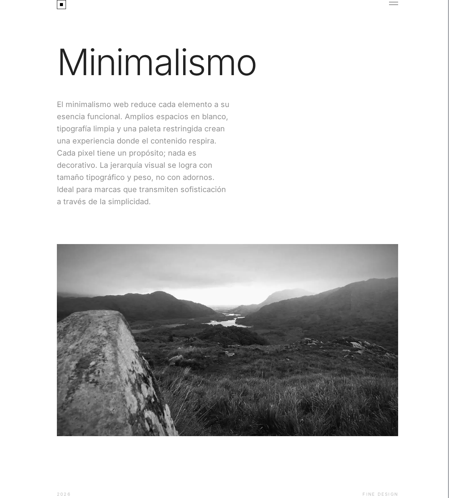 |
| **Maximalista** | 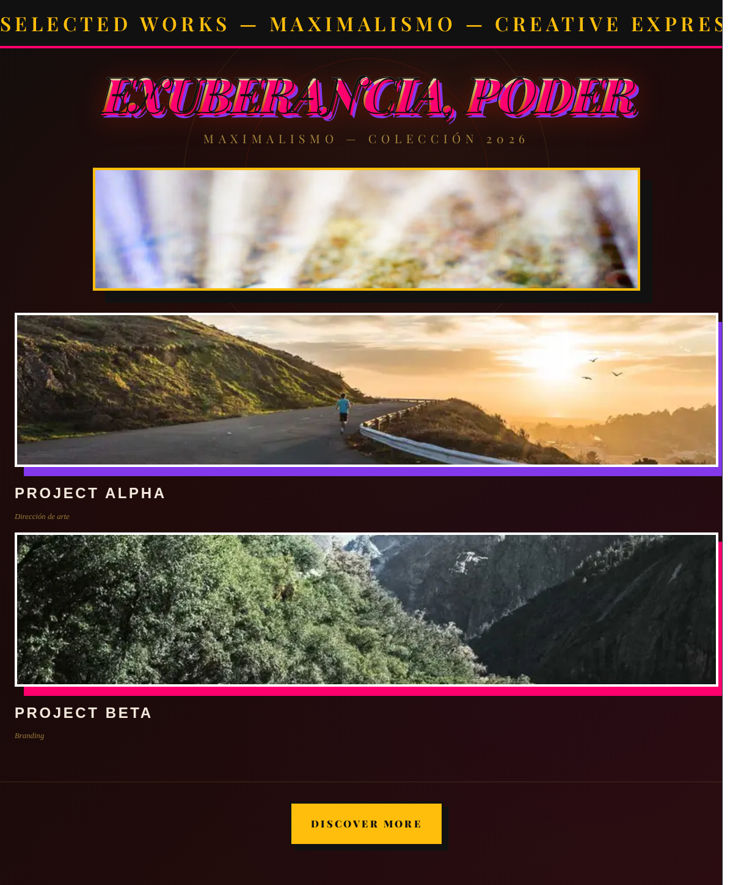 |
| **Editorial** | 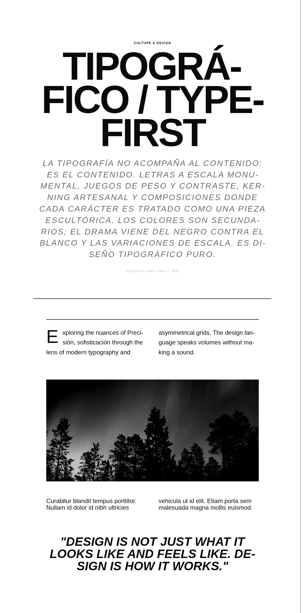 |
| **Oscuro/Dramático** | 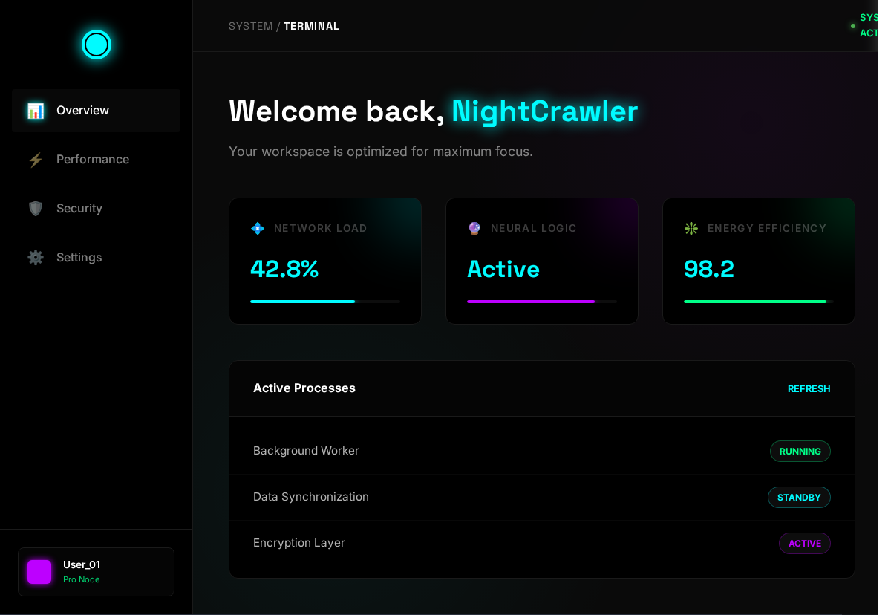 |
| **Futurista/Tech** | 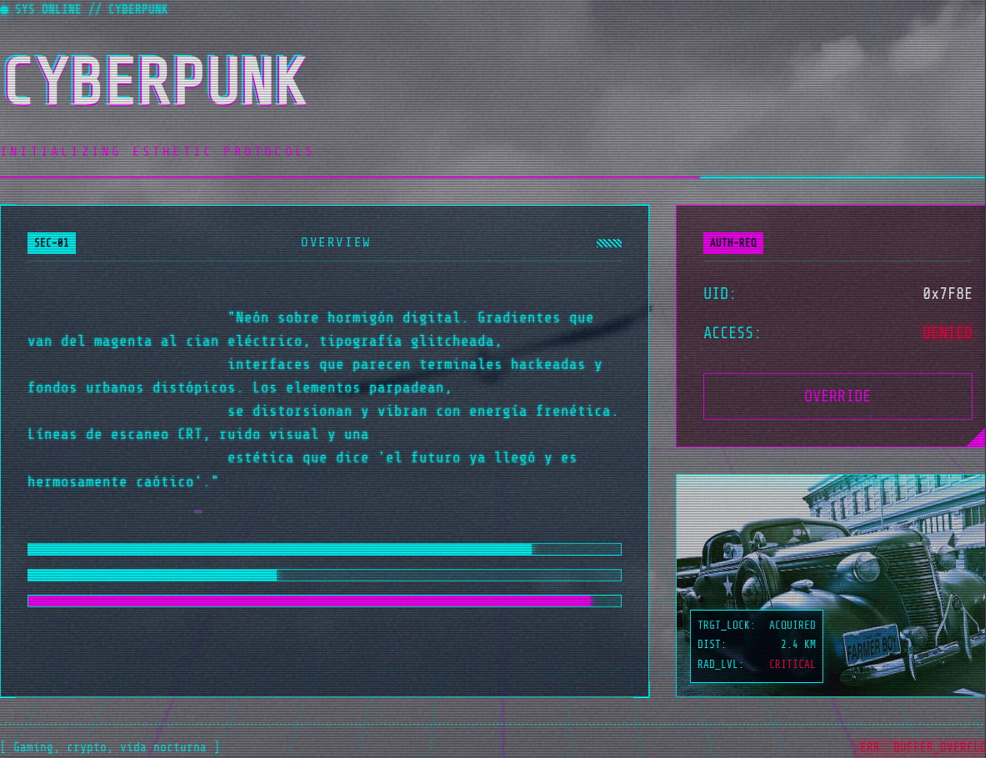 |
| **Orgánico/Natural** | 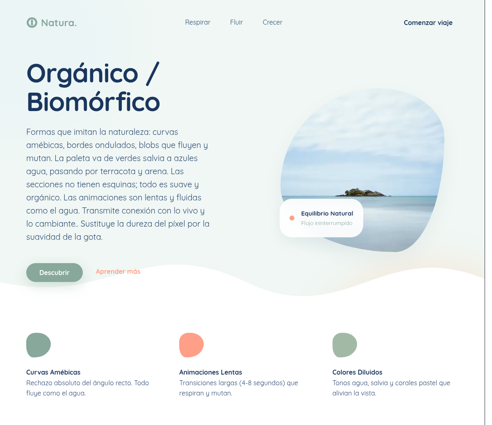 |
| **Retro/Vintage** | 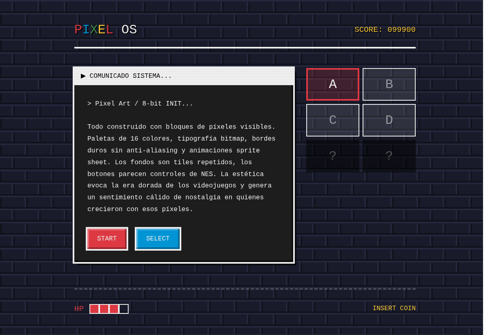 |
| **Lujo/Premium** | 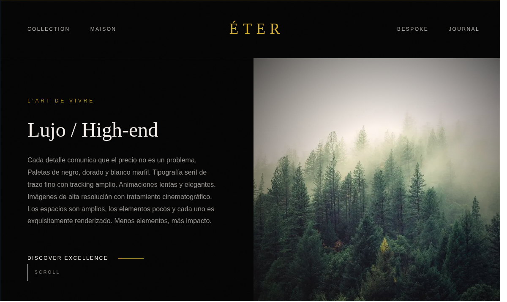 |
| **Interfaz** | 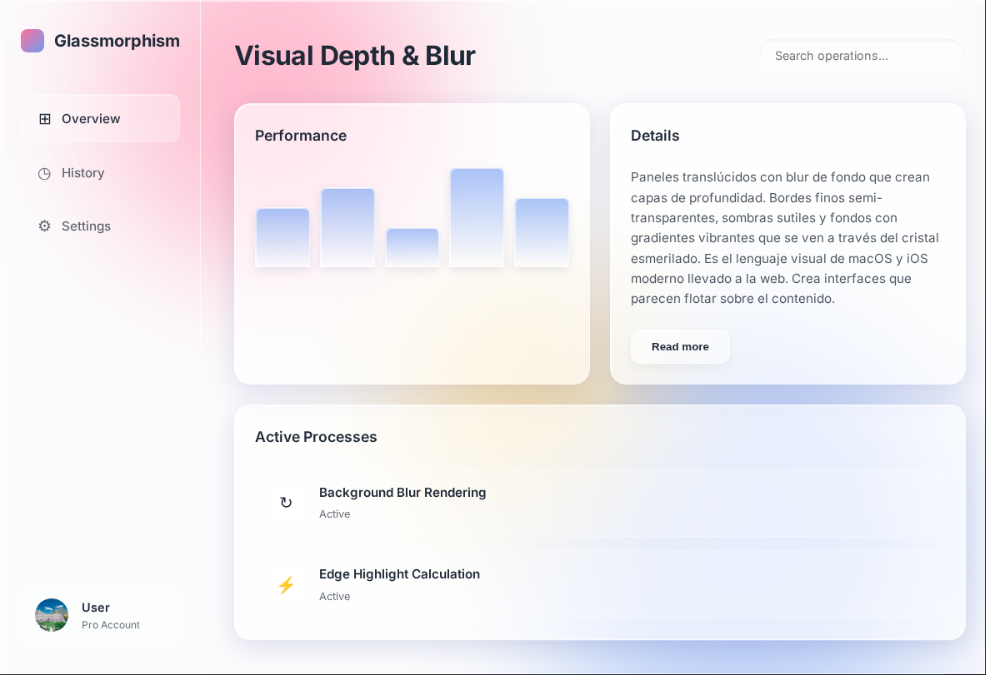 |
| **Artístico/Cultural** | 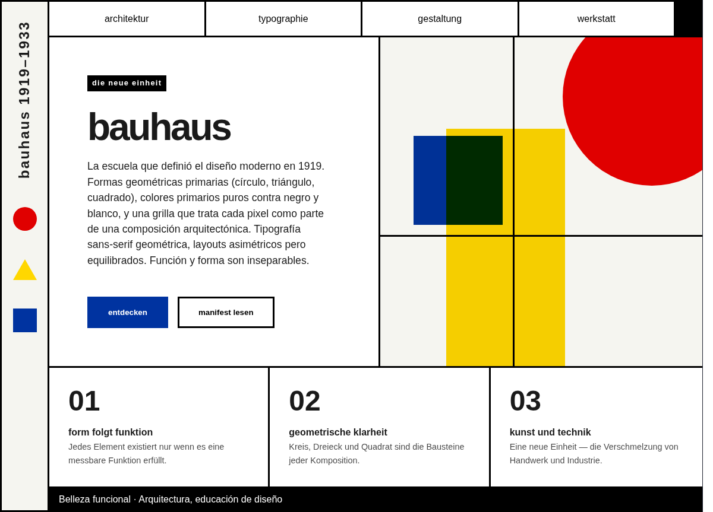 |
| **Lúdico/Creativo** | 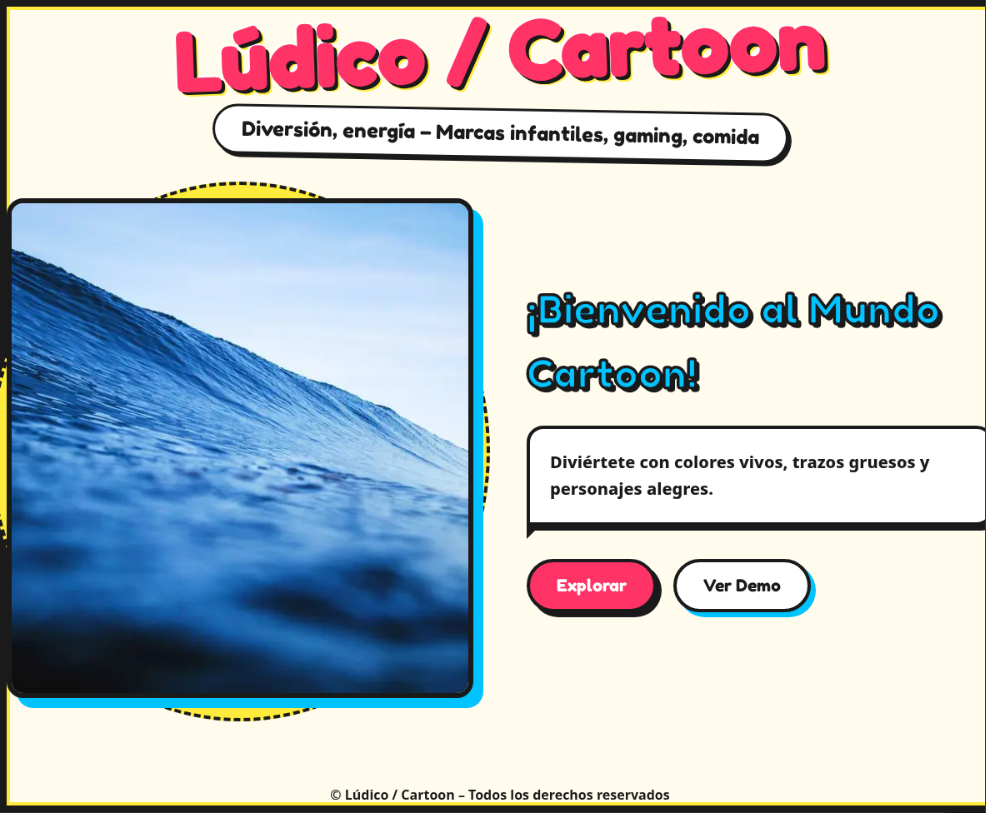 |

## Sobre el CSS Style Guide Skill

Este sitio funciona como complemento visual para el **CSS Style Guide Skill**. Si desarrollas herramientas con Inteligencia Artificial, puedes utilizar dicho *skill* (formato Markdown) para dotar a tus agentes UI o copilot de un sistema de diseño consistente basado en estas mismas reglas CSS y patrones de diseño.

Tienes un botón de acceso directo para descargar este *skill* integrado en el propio *footer* de la web.

## Licencia

Este proyecto opera bajo los términos globales de licenciamiento permisivo (MIT/Apache 2.0). Ver documentación específica del repositorio principal para más detalles sobre terceros y distribución.
